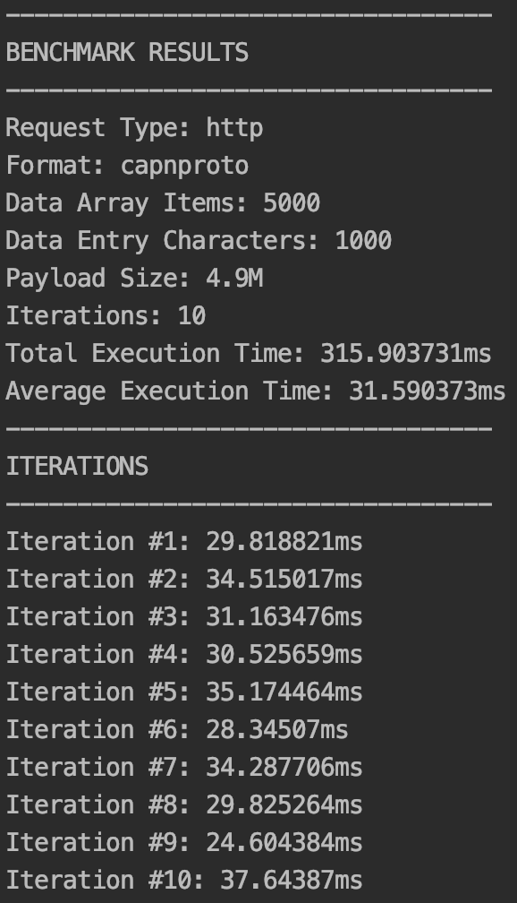

# Go Serialization Benchmarks

This utility was written to benchmark the performance of various serialization formats as well as transfer methods

Usage
-------

This project is built using a client/server model, so it can be implemented in diverse environments. As long as the proper ports are exposed, both components should be able to communicate/run benchmarks.

1) To build the project, run the build file (using a BASH terminal) located in `./scripts/build.sh`. This will build the client and server applications for your current OS/architecture and output them to the relevant folder located in `./dist`

2) Run `benchmark_server` to initialize the server on your desired machine (can be local or remote)

3) Then run `benchmark_client` to connect to the above server and run the desired benchmarks

Options for each can be found by passing a `-h` flag

Alternatively, there is a helper script that does steps 2 and 3 for you with sane defaults in `./scripts/run_benchmark.sh`

Results
-------

*These example benchmarks were run on a MacOS environment with 16GB RAM and a 2.2 GHz Intel Core i7 *

 JSON                      |  Protocol Buffers          |  Cap'n Proto               |  FlatBuffers
:-------------------------:|:-------------------------:|:-------------------------:|:-------------------------:                                                               
  |   |  | 
